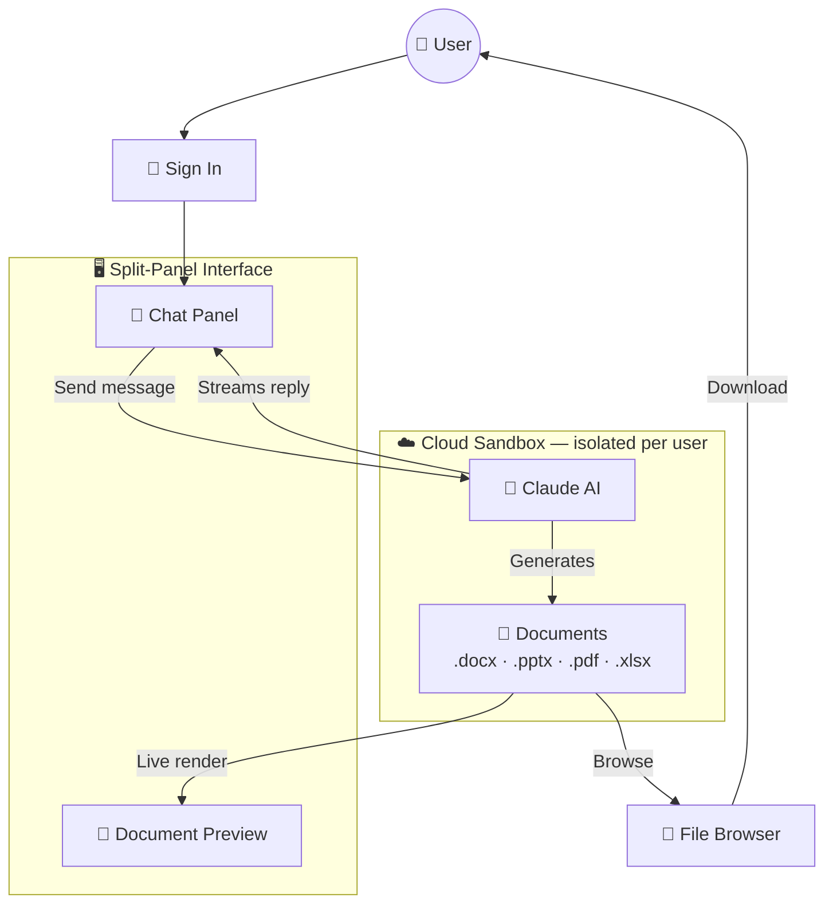
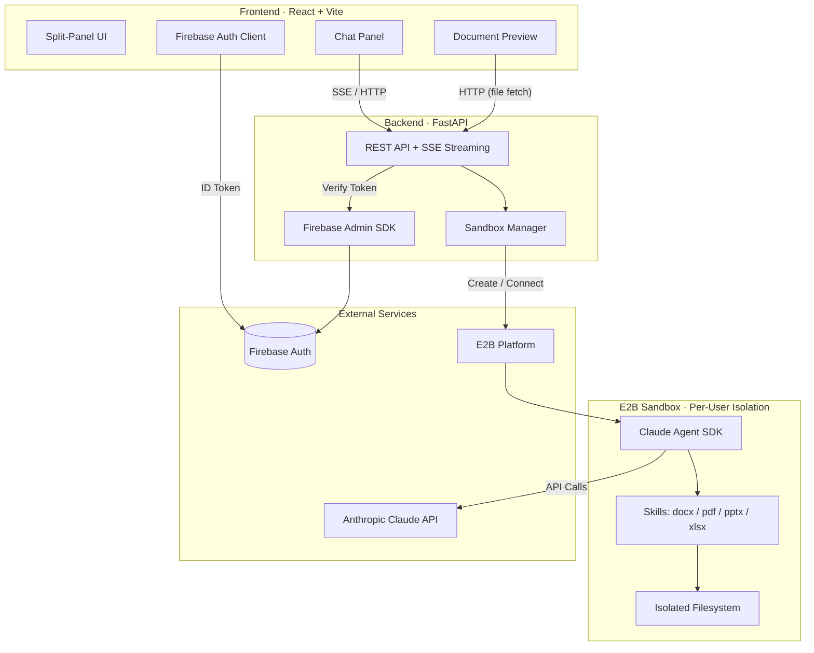

# CloudCanvasAI

An AI-powered document creation and editing platform that combines Claude AI with real-time document preview. Chat with Claude on the left, see generated documents (`.docx`, `.pptx`, `.pdf`, `.xlsx`) rendered live on the right.

## How It Works



## Technical Architecture



## Project Structure

```
CloudCanvasAI/
├── backend/          # FastAPI backend (Python)
│   ├── routers/      # API endpoints (chat SSE, file serving)
│   ├── sandbox_manager.py  # E2B sandbox lifecycle
│   ├── e2b-template/ # Custom E2B sandbox template
│   └── skills/       # Document manipulation skills
├── frontend/         # React + Vite frontend
│   ├── src/pages/    # Chat page with split-panel UI
│   ├── src/components/  # DocumentPreview, FileList
│   └── src/services/ # API client, Firebase auth
└── skills/           # Git submodule → github.com/anthropics/skills
```

## Prerequisites

- Python 3.11+
- Node.js 18+
- API keys: `ANTHROPIC_API_KEY`, `E2B_API_KEY`
- Firebase project with Auth enabled

## Setup

### Clone with submodules

```bash
git clone --recurse-submodules <repo-url>
cd CloudCanvasAI
```

If already cloned:
```bash
git submodule update --init --recursive
```

### Backend

```bash
cd backend
python -m venv venv
source venv/bin/activate
pip install -r requirements.txt
cp .env.example .env   # Fill in your API keys
uvicorn main:app --reload
```

API available at `http://localhost:8000` (Swagger UI at `/docs`)

### Frontend

```bash
cd frontend
npm install
cp .env.example .env   # Fill in Firebase config
npm run dev
```

App available at `http://localhost:5173`

## Environment Variables

See `backend/.env.example` and `frontend/.env.example` for all required variables.

Key variables:
- `ANTHROPIC_API_KEY` — Claude API access
- `E2B_API_KEY` — Sandbox creation
- `E2B_TEMPLATE` — E2B template alias (default: `cloudcanvasai-docs`)
- `VITE_API_BASE_URL` — Backend URL for production (defaults to localhost in dev)
- `VITE_FIREBASE_*` — Firebase web config

## Tech Stack

| Layer | Technology |
|-------|-----------|
| Frontend | React 19, Vite 7, Firebase Auth |
| Backend | FastAPI, Uvicorn, Claude Agent SDK |
| Sandbox | E2B Code Interpreter (per-user isolation) |
| Doc Rendering | mammoth.js (docx), react-markdown |
| Auth | Firebase (Google + email/password) |
| Deployment | Railway (backend), Vercel (frontend) |
